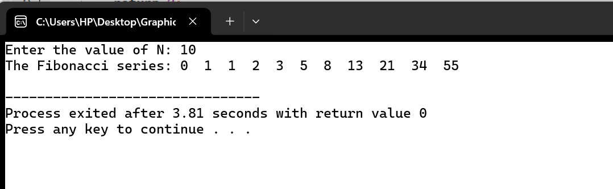

# Fibonacci Series using Recursion

The **Fibonacci series** is a sequence of numbers where each number is the **sum of the two preceding ones**, starting from **0 and 1**.

---

###  Recursive Breakdown of Fibonacci(5)

The recursive formula for Fibonacci is:

\[
F(n) = F(n-1) + F(n-2)
\]

Let's break down the calculation of **F(5)** step by step:

\[
F(5) = F(4) + F(3)
\]

- \[
= (F(3) + F(2)) + (F(2) + F(1))
\]

- \[
= ((F(2) + F(1)) + F(2)) + (F(1) + F(0))
\]

- \[
= (((F(1) + F(0)) + F(1)) + F(2)) + (F(1) + F(0))
\]

This recursive expansion continues until the **base cases** are reached:

\[
F(1) = 1, <br> F(0) = 0
\]

The recursion then **unwinds** to compute the Fibonacci number.

---

# Algorithm for Fibonacci Series using Recursion

### Step-by-Step Explanation

1. **Start**
2. **Define a function `Fibonacci(n)`**:
   - If `n == 0`: return 0 (**Base Case 1**)
   - Else if `n == 1`: return 1 (**Base Case 2**)
   - Else: return `Fibonacci(n-1) + Fibonacci(n-2)` (**Recursive Case**)
3. Take input `n` from the user.
4. Print the first `n` terms of the Fibonacci series using a loop.
5. **End**

---
## Fibonacci Visualization:



### 📌 Example Code

Here’s a simple implementation of the Fibonacci series using recursion in **JavaScript**:

```javascript
function fibonacci(n) {
    if (n === 0) return 0; 
    if (n === 1) return 1; 
    return fibonacci(n - 1) + fibonacci(n - 2); 
}

function printFibonacciSeries(n) {
    console.log("Fibonacci Series up to", n, "terms:");
    for (let i = 0; i < n; i++) {
        console.log(fibonacci(i));
    }
}

const n = parseInt(prompt("Enter the number of terms: "), 10);
printFibonacciSeries(n);
